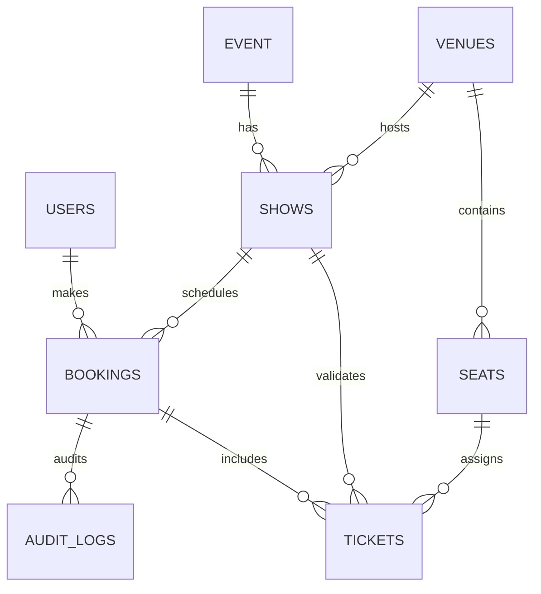

# 🎟️ Ticket Booking System

A robust and scalable relational database system for managing event tickets, venues, and user bookings. Built with **Oracle SQL** and **PL/SQL**, this project implements core DBMS principles including ACID properties, triggers, and stored procedures.

---

## 🚀 Overview

The **Ticket Booking System** is designed to handle the full lifecycle of an event booking process. From managing diverse events (Movies, Concerts, Sports) to seat allocation across various venues, the system ensures data integrity and high performance through advanced database features.

### ✨ Key Features
- **Comprehensive Schema**: Optimized tables for Users, Events, Venues, Shows, and Seats.
- **Real-time Availability**: PL/SQL functions to check seat availability instantly.
- **Atomic Bookings**: Stored procedures for booking tickets with built-in race condition handling.
- **Audit Logging**: Automatic tracking of booking operations for security and history.
- **Reporting**: Automated revenue reports categorized by event titles.

---

## 📊 Database Schema

The system is built on a normalized relational structure. Below is a high-level representation of the entities and their relationships:



---

## 🛠️ Technical Implementation

### 1. Relational Tables
- **`USERS`**: Manages customer profiles and authentication data.
- **`EVENT`**: Catalogs different types of events (Movie, Concert, Standup, etc.).
- **`VENUES`**: Details of locations and their capacities.
- **`SHOWS`**: Links events to venues with specific timing and pricing.
- **`SEATS`**: Categorized seating (Platinum, Gold, Silver) linked to venues.
- **`BOOKINGS` & `TICKETS`**: Tracks transactions and specific seat assignments.

### 2. Business Logic (PL/SQL)
- **`fn_is_seat_available`**: A deterministic function to ensure no double-bookings.
- **`pr_book_ticket`**: A procedure that encapsulates the booking logic, ensuring atomic operations.
- **`trg_audit_booking`**: A trigger that captures every booking change for audit trails.
- **`pr_generate_revenue_report`**: An analytical tool for administrators to monitor financial performance.

### 3. Views
- **`VIEW_ACTIVE_SHOWS`**: A simplified view for the frontend to fetch upcoming events and availability.

---

## 🚦 Getting Started

### Prerequisites
- Oracle Database (12c or later recommended).
- SQL Developer, DBeaver, or Oracle SQL*Plus.

### Setup Instructions
1. Clone the repository:
   ```bash
   git clone https://github.com/SehajdeepSinghNibber/DBMS-Project.git
   ```
2. Execute the initialization script:
   ```sql
   @Ticket_booking_system.sql
   ```
   *This script will create the schema, initialize sample data, and compile all PL/SQL objects.*

3. Verify the installation by running the test block at the end of the script to see the revenue report.

---

## 🔮 Future Roadmap
- [ ] **REST API**: Integration with Express.js for a robust backend.
- [ ] **Modern UI**: React-based dashboard for users and admins.
- [ ] **Payment Gateway**: Mock integration for transaction processing.
- [ ] **Notifications**: Email/SMS alerts for successful bookings.

---
*Developed as part of the Database Management Systems (DBMS) Course.*
